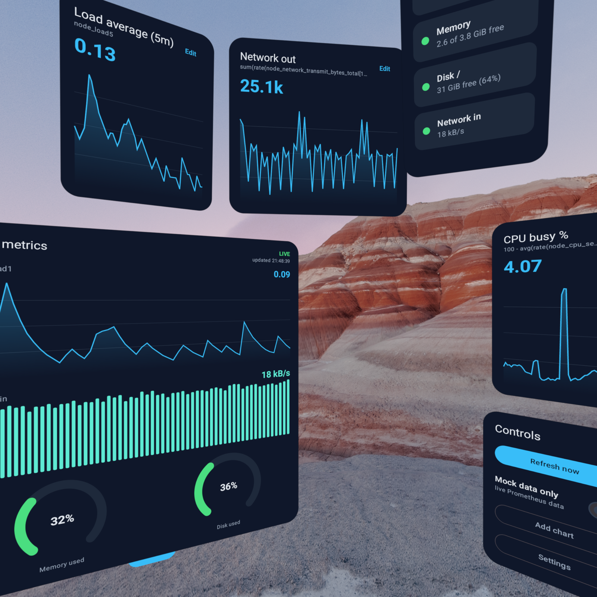

# OpsDeck

An infrastructure monitoring dashboard for Android XR. Floating panels in Full Space show
node metrics (load average, memory, disk, network) pulled live from the public Prometheus
demo instance, with a local data generator as fallback when the network is unavailable.

Built with the native Jetpack XR SDK and tested entirely in the Android XR emulator.

## Stack

* Kotlin 2.3, Jetpack Compose (BOM 2026.03)
* Jetpack XR SDK: Compose for XR 1.0.0-alpha17, SceneCore 1.0.0-beta02
* OkHttp and kotlinx.serialization for the Prometheus HTTP API
* Charts (line, bars, radial gauges) drawn with plain Compose Canvas, no chart library

## Running it

You need Android Studio with XR support and the Android XR emulator:

1. Install the Android XR system image and create an XR headset AVD
   (Device Manager, category "XR").
2. Open the project and run the `app` configuration on that AVD.

The app starts in Full Space with three panels: a metrics panel (load average line chart,
network traffic bars, memory and disk gauges), a node status list and a small control panel.
"Add chart" spawns extra panels with your own PromQL queries. The editor leads with preset
queries so you mostly pick instead of typing, which matters in a headset; a free-text field
and a line/bars switch cover the rest. Charts are saved and come back on restart, each one
floats as its own movable panel with an Edit button. In the emulator you grab and move panels with the mouse, the
handles below each panel come from the system. The refresh button under the chart is an
Orbiter attached to the panel edge.

Metrics come from `https://prometheus.demo.prometheus.io` by default. The Settings button
on the control panel opens a separate panel where you can point the app at your own
Prometheus server (https URL plus an optional bearer token), the values are saved between
launches. If the server is unreachable the app silently switches to generated data shaped
like the same node_exporter metrics. The badge in the chart panel shows which source is
active (LIVE or MOCK), and the switch on the control panel forces the generator on, which
is handy for demos without network.

## What this demonstrates

* a Full Space scene with several `SpatialPanel` composables
* a volumetric 3D bar chart: glTF geometry generated from live data at runtime
  and rendered with `SpatialGltfModel`
* threshold alerting: a pulsing border on the status panel plus a `SpatialDialog`
  popping out in front of the user
* user-defined chart panels created and edited at runtime, persisted as JSON
* a metric name browser and query presets in the chart editor, 15m/1h/6h ranges
* `movable` and `resizable` subspace modifiers with custom move policies
* panel positions, rotations and sizes survive app restarts and device reboots
* an `Orbiter` with controls anchored to a panel
* data updating on a 15 second poll plus manual refresh
* fallback between a real API and a local generator behind one repository interface
* a plain 2D layout for Home Space and non-XR devices

## Roadmap

* more metrics and per-host drill down
* point it at real infrastructure instead of the demo instance
* try it on real hardware once a devkit is available
